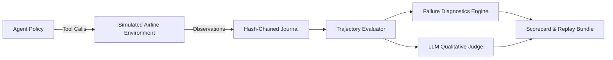

# Flight Agent Evaluator

Flight Agent Evaluator is an evaluation, failure diagnostics, and replay framework for testing AI agents against complex aviation operational tasks. It provides a deterministic in-memory airline environment, multi-path constraint graph trajectory scoring, causal failure diagnostics, cryptographic run replay, and an evidence-grounded LLM judge.



## Key Capabilities

- **Transactional Airline Environment**: In-memory booking engine with multi-seat holds, virtual clock expirations, idempotency registry, and human-in-the-loop approval verification.
- **Constraint Graph Trajectory Scoring**: Branch-and-bound matching over Directed Acyclic Graphs (DAGs) supporting multiple valid solution paths, data dependencies, and ordering constraints.
- **Safety Dominance**: Side-effect safety violations (such as unauthorized booking modifications) unconditionally fail the evaluation.
- **Causal Failure Diagnostics**: Root-cause analysis mapping execution failures to 40+ structured failure codes across agent, environment, provider, and benchmark domains.
- **Cryptographic Recording & Replay**: Append-only hash-chained journals (`.jsonl`), run summaries (`.meta.json`), and bundle manifests (`.bundle.json`) with byte-level tamper detection.
- **Packaged Distribution**: Standard Python wheel containing built-in benchmark corpora and scenarios runnable completely offline without network or API keys.

---

## Quick Start

### Installation

Install the wheel using `pip` or `uv`:

```bash
uv pip install flight-agent-evaluator
```

### CLI Commands

```bash
# Run the canonical zero-network demo
flight-evaluator demo

# List built-in benchmark suites
flight-evaluator benchmark list

# Run the canonical benchmark suite
flight-evaluator benchmark run

# Validate benchmark corpus integrity and SHA-256 digests
flight-evaluator benchmark validate

# Verify release readiness and resource packaging
flight-evaluator benchmark verify-release
```

---

## Example Evaluation Output

```
================================================================================
                      BENCHMARK EXECUTION SUMMARY
================================================================================
Manifest Digest:      3a02e537a35257c6148a0891d62cd7dafc41ea619a8d87dacf5edf5d7149e04d
Scenarios:            24
Total Runs:           48
Task Success Rate:    100.0%
Safety Pass Rate:     100.0%
Average Score:        0.925 / 1.000
--------------------------------------------------------------------------------
AGENT BREAKDOWN:
  - scripted-oracle     : pass_rate=100.0%, avg_score=1.000
  - naive-baseline      : pass_rate=85.0%, avg_score=0.850
================================================================================
```

---

## Architecture & Documentation

- [`docs/architecture/overview.md`](docs/architecture/overview.md) — System architecture and package topology.
- [`docs/architecture/evaluation.md`](docs/architecture/evaluation.md) — Trajectory evaluator and causal failure diagnostics.
- [`docs/architecture/transactional-environment.md`](docs/architecture/transactional-environment.md) — Simulated environment and side-effect safety.
- [`docs/architecture/replay.md`](docs/architecture/replay.md) — Cryptographic recording and semantic replay.
- [`docs/methodology/benchmark.md`](docs/methodology/benchmark.md) — Benchmark design principles and manifest binding.
- [`docs/methodology/scoring.md`](docs/methodology/scoring.md) — Scoring profile and fail-closed invariants.
- [`docs/methodology/judge-validation.md`](docs/methodology/judge-validation.md) — LLM judge evidence package and rubric anchors.

---

## Limitations

- **Simulated Environment**: Operates over synthetic airline state models rather than live airline GDS systems.
- **Human Calibration**: The LLM judge rubric and bias probes are fully engineered; dataset calibration against human annotators is an ongoing research area.

---

## Development

```bash
# Install dependencies
uv sync --locked --all-groups

# Run linters and type checkers
uv run ruff check .
uv run ruff format --check .
uv run mypy src tests scripts

# Run full test suite with branch coverage
uv run pytest --cov=flight_agent_evaluator --cov-branch --cov-fail-under=90

# Run all quality gates
uv run python scripts/check.py
```

## License

MIT. See `LICENSE`.
