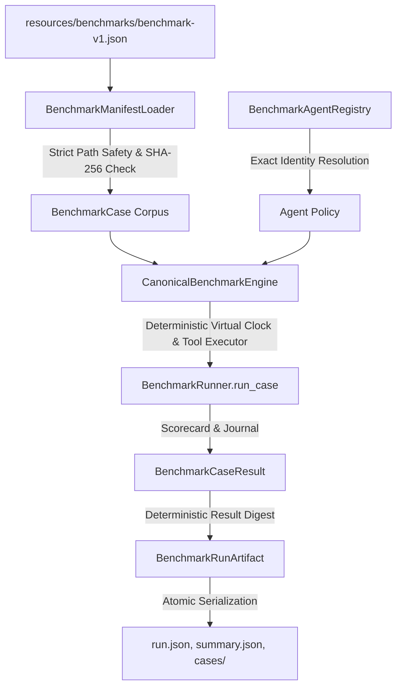

# Canonical Benchmark Pipeline Architecture

## 1. Overview

The Canonical Benchmark Pipeline establishes an authoritative, manifest-bound, tamper-evident evaluation harness for autonomous flight agents. It eliminates ad-hoc scenario discovery, implicit fallbacks, unverified model aliases, and uncalibrated metrics by enforcing strict content-addressed integrity across all scenario specifications and expectation graphs.

---

## 2. Core Architectural Components

### 2.1 Benchmark Manifest (`manifest.py`)
- **Immutability & Safety**: Defined via frozen Pydantic models (`BenchmarkManifest`, `BenchmarkScenarioEntry`, `BenchmarkAgentEntry`, `BenchmarkRunPolicy`).
- **Path Security**: All relative paths are constrained to the repository resource root. Path traversal (`..`) and absolute paths are strictly rejected at parse time.
- **Canonical Content Digest**: SHA-256 computed over key-sorted, compact canonical JSON without wall-clock timestamps or volatile metadata.

### 2.2 Manifest Loader (`loader.py`)
- **Byte-Level Verification**: Computes SHA-256 over raw file bytes prior to JSON parsing. Any divergence between declared and actual hashes raises `ResourceDigestMismatchError`.
- **Immutable Case Tuple**: Assembles `BenchmarkCase(manifest_entry, scenario, expectation, scenario_raw_sha256, expectation_raw_sha256)`.

### 2.3 Exact Agent Registry (`registry.py`)
- **Zero Hallucination / Zero Fallback**: Maps explicit identifiers (`scripted-oracle`, `naive-baseline`, `random-baseline`) to concrete agent implementations. Unknown model identifiers fail closed with `UnknownBenchmarkAgentError`.
- **Elimination of Fake Model Names**: Model strings (e.g. `gpt-4o`) cannot silently resolve to scripted oracle policies.

### 2.4 Canonical Benchmark Engine (`engine.py`)
- **Authoritative Orchestration**: Loads manifest, validates SHA-256 bindings, resolves exact agents, and coordinates case execution via `BenchmarkRunner.run_case()`.
- **Aggregate Metrics & Atomic Persistence**: Computes deterministic aggregate metrics (`task_success_rate`, `safety_pass_rate`, `evaluator_error_rate`) and commits run artifacts atomically to disk (`summary.json`, `run.json`, `cases/*.json`).

---

## 3. Invariants Enforced

1. **Fail-Closed Resolution**: Missing scenarios, missing expectations, or unknown agents fail immediately with explicit integrity exceptions.
2. **Deterministic Digests**: Semantic results and manifest identities are computed purely from deterministic fields, excluding elapsed wall-clock time.
3. **Equivalence of Entrypoints**: Library execution and CLI execution share the exact same `CanonicalBenchmarkEngine` implementation and result models.
