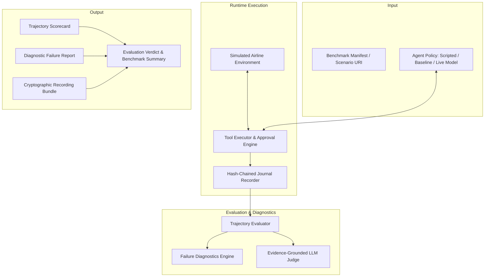

# Flight Agent Evaluator — Architectural Overview

## System Purpose

Flight Agent Evaluator is an evaluation framework for testing AI agents against complex airline domain tasks. It combines:
1. **Deterministic Execution**: In-memory simulated airline environment with state machines, idempotency tracking, and approval governance.
2. **Trajectory Evaluation**: Goal accuracy, tool parameter validation, dependency satisfaction, ordering constraints, and safety boundary enforcement.
3. **Failure Diagnostics**: Causal graph analysis identifying root causes, contributing factors, and critical decision steps from recorded execution journals.
4. **Semantic Replay**: Hash-chained audit journals, cryptographic bundle manifests, and deterministic re-execution with tamper detection.
5. **Packaged Distribution**: Self-contained benchmark corpora and execution engine operating offline without external network dependencies.

## Core Subsystems

| Subsystem | Package | Responsibility |
| --- | --- | --- |
| **Contracts** | `flight_agent_evaluator.contracts` | Pydantic schema models for aviation entities, scenarios, events, and trajectory expectations. |
| **Environment** | `flight_agent_evaluator.environment` | Simulated airline booking engine with seat holds, approval verification, and idempotency key registry. |
| **Tools** | `flight_agent_evaluator.tools` | Typed tool definitions (`flight.search`, `booking.hold`, `booking.confirm`, etc.) with security enforcement. |
| **Evaluation** | `flight_agent_evaluator.evaluation` | Multi-path constraint graph matching, deterministic scoring, and causal failure root-cause analysis. |
| **Judges** | `flight_agent_evaluator.judges` | Evidence-grounded qualitative evaluation with rubric anchoring and offline replay support. |
| **Recording & Replay** | `flight_agent_evaluator.recording`, `flight_agent_evaluator.replay` | Hash-chained journals (`.jsonl`), run metadata (`.meta.json`), bundle manifests (`.bundle.json`), and deterministic re-execution comparator. |
| **Benchmarks** | `flight_agent_evaluator.benchmarks` | Manifest validation, ablation pipelines, release verification, and multi-agent benchmark execution. |
| **Resources** | `flight_agent_evaluator.resources` | Authoritative package resource locators for built-in and external scenarios, expectations, and manifests. |
| **CLI** | `flight_agent_evaluator.cli` | Terminal interface for running benchmarks, validating scenarios, replaying journals, and running portfolio demos. |
