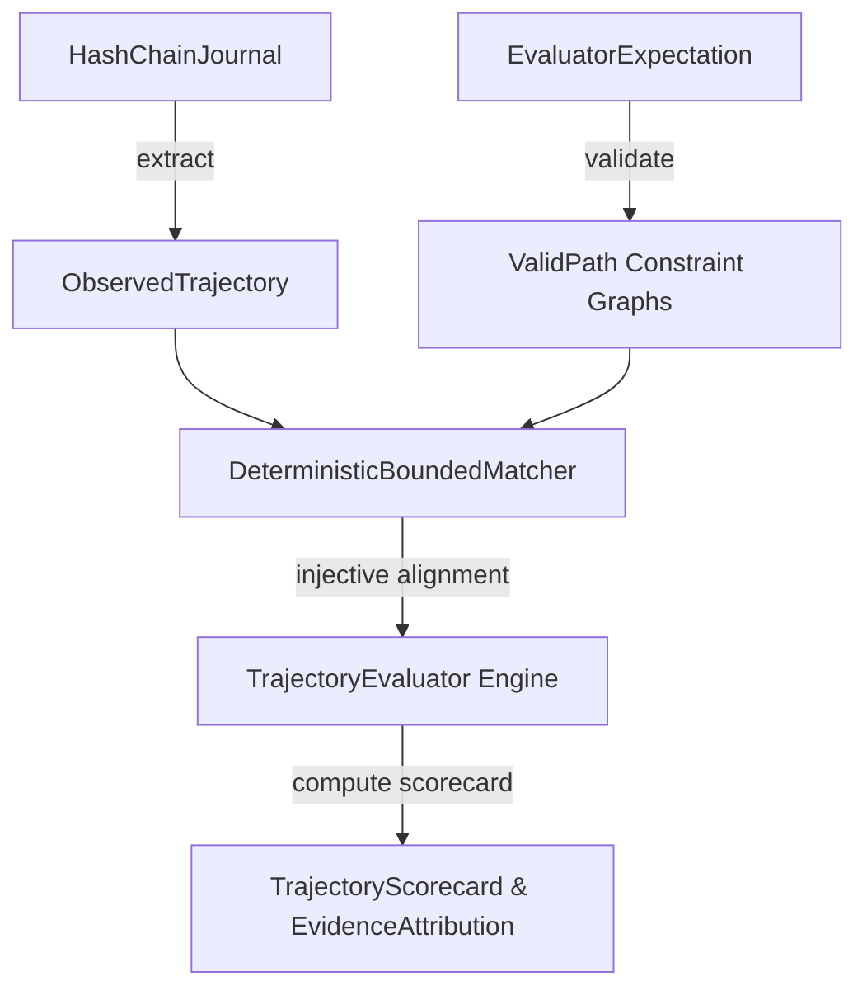

# Architecture Document — Stage 2: Trajectory Evaluator Engine

## Overview
The Trajectory Evaluator Engine evaluates AI agent execution traces against versioned constraint graphs supporting multiple valid solution paths without requiring exact golden traces.

## System Architecture Diagram

## Key Architectural Principles

1. **Hidden Expectation Boundary**:
   Public scenario definitions contain zero expectation rules or golden trace details. Expectations are stored separately under `resources/expectations/<scenario_id>.json` and loaded exclusively by the evaluator.

2. **Pure Data Expectations**:
   Graph nodes, selectors, argument constraints, dependency rules, and precedence edges are strict Pydantic model data structures without executable code (`eval`/`exec`).

3. **Deterministic Bounded Matcher**:
   Replaces naive greedy matching with branch-and-bound optimization to find the global optimal injective alignment $\mathcal{M}^*: \mathcal{N}_k \to \mathcal{T}_{obs}$ under complexity bounds ($N \le 20$, $|\mathcal{T}_{obs}| \le 50$, search states $\le 10,000$).

4. **Multi-Dimensional Scorecard**:
   Produces an 8-component score vector: `(Outcome, ToolSelection, ArgumentCorrectness, Dependency, Ordering, Efficiency, Recovery, Safety)`.
